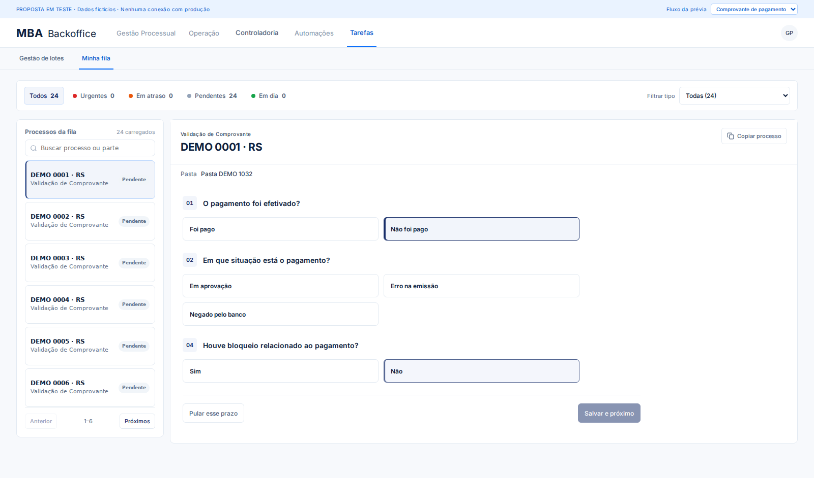
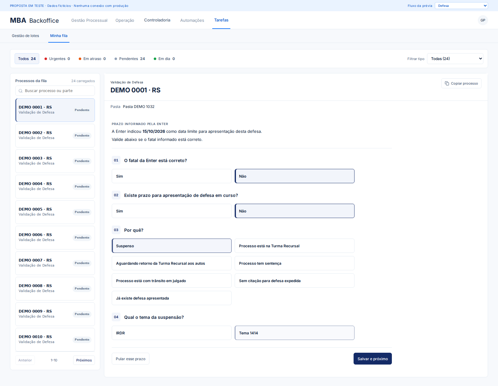

# Workspace de tarefas — revisão de UX

Alterações na branch `dev/tasks-workspace`, sem deploy ou alteração de produção.

## Estrutura e perguntas

Defesa, Liminar, Pagamento, Protocolo e Acordos compartilham o contexto do processo, `TaskQuestion`, opções de resposta e `TaskActionBar`. A largura e os espaçamentos são constantes; a altura acompanha o conteúdo. A barra de ações é sticky e mantém “Pular esse prazo” e “Salvar e próximo”. Não há rolagem interna do workspace. A fila ajusta a quantidade de itens ao conteúdo e mantém paginação.

Removidos o card de concluídos/status/prazo, resumos de respostas, indícios e classificações apresentadas ao operador. Pasta e provisão continuam como dados do processo. O tipo exibido no cabeçalho deriva da tarefa ativa; o seletor foi identificado como “Filtrar tipo” para distinguir filtro de indicador.

Perguntas condicionais usam o mesmo componente independente. Cards usam radios reais, suporte a teclado, foco visível e seleção com borda lateral além da cor azul do tema. Estados são isolados por tarefa/processo. Acordos preserva sua navegação controlada pelo backend, sem remontar o módulo ao receber o próximo processo. Em Protocolos apenas arquivos já enviados são preservados no cache; respostas e justificativas são reiniciadas.

## Defesa e Liminar

O fatal da Enter aparece em contexto compacto com data destacada. “Suspenso” fica selecionado imediatamente; o tema aparece como pergunta 04 independente. Trocar o motivo limpa o tema anterior.

Liminar segue exatamente a árvore solicitada: pedido de tutela → decisão judicial → deferida/indeferida; no ramo sem decisão, pergunta sobre sentença. Alterar respostas pai limpa respostas filhas. O adaptador preserva os resultados legados `nao_solicitada`, `deferida`, `indeferida`, `com_sentenca` e `sem_decisao`.

O contrato de Defesa V3 da etapa anterior permanece: conclusão e prioridade são resolvidas no backend. Não houve alterações de API, banco, workers ou classificações nesta refatoração. Frontend e backend V3 precisam de homologação conjunta antes da promoção; não foi feito deploy.

## Protocolos

Justificativa aparece e é obrigatória somente para “Outro motivo”. Trocar de motivo limpa o texto. Para motivos predefinidos, o payload mantém o campo legado `notes` com o próprio rótulo do motivo, garantindo compatibilidade sem exigir texto do operador. Upload em duas etapas, PDF e commit permanecem intactos.




## Validação local

```bash
npm run build
npm run build:ux
npm run test:hardening
npm run test:metabase
npm run test:ux
```

Para Chromium alternativo: `UX_CHROMIUM_PATH=/caminho/chromium npm run test:ux`.

A prévia usa componentes reais com dados fictícios, sem conexão com produção. Testes de interação cobrem os cinco ramos de Liminar, mudança de ramo, seleção/tema de suspensão, evidências de Defesa, envio dos formulários, justificativa condicional de Protocolo, PDFs, reset e navegação, teclado, responsividade e ausência de rolagem interna. Capturas em 1920, 1600, 1366 e 390 px ficam em `.build/ux-qa`.

As verificações de envio interceptam as APIs localmente. Operação com dados reais em homologação continua pendente. Atualização por evento do backend fica para a etapa separada solicitada.
