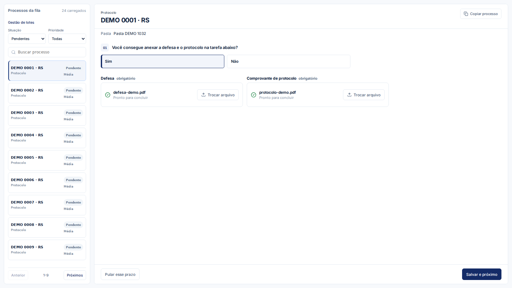
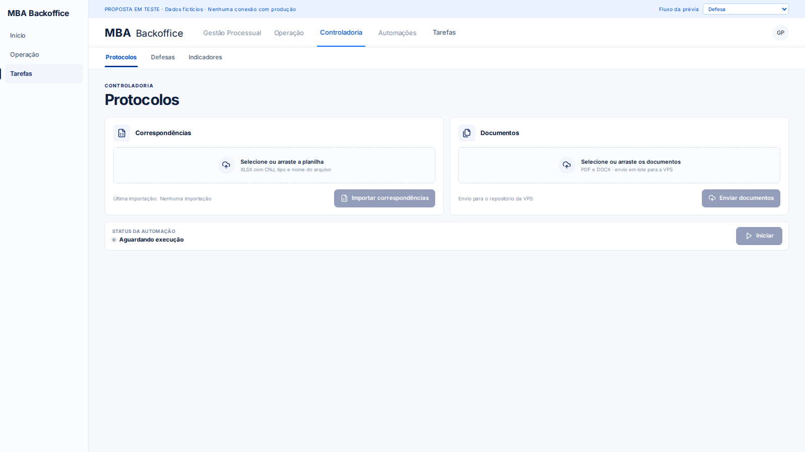
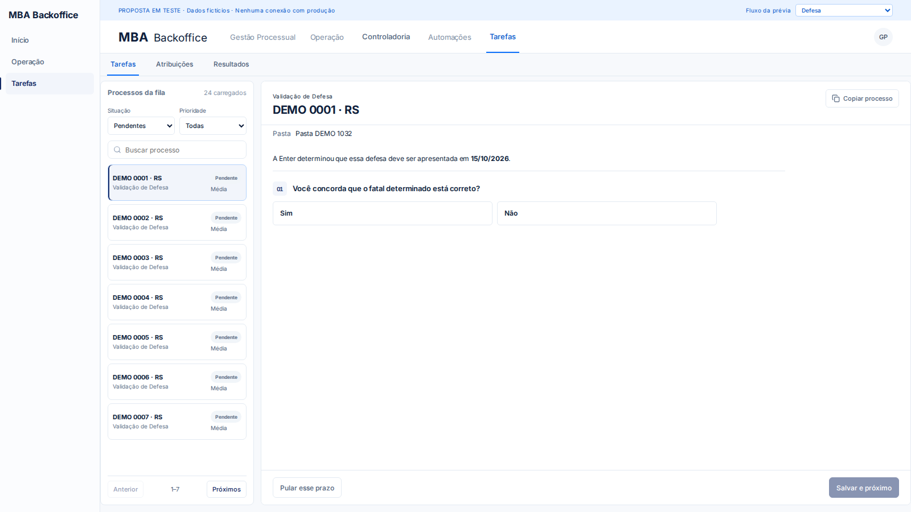

# Estação de tarefas — revisão de UX

Frontend: `dev/tasks-workspace`. Backend: `main`. Nenhum deploy ou alteração no banco de produção.

## Estação

Workspace com altura disponível da viewport igual para todas as tarefas, descontando a navegação global e local. Navbar e sidebar globais permanecem visíveis. A subnav mostra “Tarefas | Atribuições | Resultados”. Atribuições conserva a gestão de lotes e suas permissões; Resultados reserva o espaço do futuro embed do Metabase, ainda sem dashboard configurado. Densidade ajustada com CSS, sem zoom.

A fila tem situação e prioridade lado a lado, busca apenas por número do processo, paginação adaptada ao espaço e prioridades recebidas do backend. Pular manda o processo ao final da fila. Concluídos aparecem como consulta, sem formulário de execução.

Conteúdo e ações têm containers separados. “Pular esse prazo” e “Salvar e próximo” ficam no rodapé, sempre na mesma posição. Há rolagem de conteúdo como fallback para telas menores ou formulários extensos; a página não rola. Cards de uma mesma pergunta têm dimensões iguais. Radios acessíveis, teclado e azul do tema compartilhados. Respostas filhas são limpas ao trocar de ramo e ao navegar entre processos.

## Perguntas

- Defesa: concordância com fatal da Enter → determinação judicial → fatal válido no tribunal → data do expediente ou andamentos da citação. Sem Fatal Real CPJ. Sem data válida, o frontend não inventa prazo; backend valida conclusão e prioridade.
- Protocolos: Sim/Não para anexar defesa e protocolo. Sim abre os dois PDFs. Não oferece apenas defesa concluída externamente ou ainda não protocolada, sem justificativa.
- Liminar: sentença numerada 03.
- Comprovante: pagamento e localização do comprovante com Sim/Não; bloqueio numerado conforme o ramo. Sem pasta no contexto.





## Protocolos da Controladoria

A página mostra somente Correspondências, Documentos e Status da automação. Correspondências usa o fluxo existente da relação XLSX (CNJ, tipo e nome do arquivo); Documentos permite selecionar/arrastar múltiplos PDF/DOCX e envia os originais ao inbox da VPS. Cada arquivo é enviado em uma requisição; falhas mantêm apenas os pendentes para nova tentativa. O envio não inicia o worker. Removidos fila, indicadores, seção recolhida, baixar exceções e atualizar manualmente.

Status consulta somente /api/protocolo/summary, periodicamente enquanto a página está visível. Os estados vêm do backend: fazendo login, pronto para executar, em produção, erro de sessão ou indisponível. “Iniciar” mantém a permissão automations.run. O frontend nunca se conecta diretamente ao filesystem ou ao Supabase.




## Backend e homologação

Defesa V4 usa contexto autorizado e RPC atômica existente; V3 permanece compatível. Os dois novos motivos de Protocolo dispensam justificativa, mantendo validação dos clientes antigos.

O formulário de Comprovante já enviava V2, enquanto a main aceitava somente V1. A correção preserva todas as respostas, inclusive manifestação e aprovação pendente, em um contrato V2 separado. A migração `20261004040000_task_payment_answers_v2.sql` foi somente versionada no backend: precisa ser aplicada e testada em homologação antes de deploy. O contrato V1 permanece intacto. Os relatórios que consumirem V2 devem usar `payment_receipt_answers_v2`; não se converte aprovação pendente em recusa bancária.

## Validação

```bash
npm run build
npm run build:ux
npm run test:hardening
npm run test:metabase
UX_CHROMIUM_PATH=/caminho/chromium npm run test:ux
```

Componentes reais com fixtures locais. Interações cobrem os ramos, payloads, limpeza de estado, PDF, filtros, consulta de concluídos, teclado, cards iguais, ações fora da rolagem e viewports 1920, 1600, 1366 e 390 px. APIs interceptadas, sem gravações reais. Backend: testes de respostas e integração com RPC simulada; SQL e PL/pgSQL analisados sintaticamente. Migração ainda não executada em Postgres. Novo upload validado com filesystem temporário e rota Flask: tipo/conteúdo/tamanho, nomes, duplicação, conflito e permissão. Testes de interface também cobrem upload parcial, retomada, campos multipart, status e a navegação real com sidebar/topbar. Atualização por evento fica para a etapa separada solicitada.
