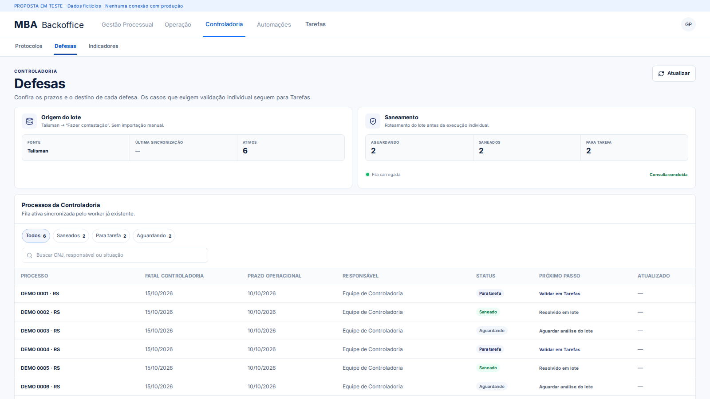

# Proposta de frontend — Tarefas e Controladoria

Branch de teste: `test/tasks-controladoria-ux`, baseada no frontend atual de `main` (2162b8c). Não há deploy, merge, alterações de autenticação, API, banco ou processos reais.

## Intenção

Tarefas é o lugar para executar: selecionar processo → conferir evidências → registrar decisão. Controladoria é o lugar para acompanhar o fluxo e resolver impedimentos. A proposta preserva navegação horizontal, densidade operacional, cores e componentes existentes.

## Mudanças implementadas

- **Minha fila** e **Gestão de lotes** distinguem execução individual de distribuição. Filtros horizontais liberam a coluna para processos. A seleção de um filtro vazio permanece explícita, e atualizar não redefine os filtros. Busca e navegação anterior/próximos permitem acessar registros além dos primeiros cinco.
- **Protocolos:** revisão e falta de documentos ganham atalhos para a fila correspondente. Importações ficam em uma seção recolhível, preservando arquivos selecionados e retornos de importação. Estados do agente, nova tentativa autorizada pelo backend e regras de permissão permanecem existentes.
- **Defesas:** destino é apresentado como próximo passo. Tabela com 25 linhas por página, busca identificada para acessibilidade e preservação dos últimos dados quando a atualização falha. “Fila carregada” indica o resultado da consulta, sem afirmar que o worker está saudável.
- Ajustes de tipografia, densidade e responsividade restritos às telas operacionais. O módulo ainda não disponível de Liminar deixa de aparecer como aba desativada.

## Prévia isolada

```bash
npm ci
npm run dev:ux
```

Abra o endereço informado pelo Vite (porta 5174). A entrada `ux-preview/` monta os componentes reais com dados fictícios. Não importa configuração de API, login ou clientes de produção. Gravações e exportações são bloqueadas. `npm run build:ux` gera a demonstração em `.build/ux-preview`; ela não faz parte de `npm run build` nem do artefato de produção.




## Validação

- Build TypeScript/Vite do frontend e da prévia.
- Checks existentes de hardening e arquitetura Metabase.
- Teste de interação: navegação além de cinco processos, filtro vazio sem mudança silenciosa, busca, filtro de revisão, importação recolhível, troca de módulos e nova tentativa desativada sem permissão.
- Renderização inspecionada em 1920×1080, 1600×900 e 1366×900; verificações adicionais em 768 e 390 pixels. Sem transbordamento horizontal da página. Tabelas mantêm rolagem própria.
- Teste da prévia confirma ausência de erros JavaScript e de requisições externas.

Para repetir a verificação visual com Chromium instalado:

```bash
npx playwright install chromium
npm run test:ux
```

Se houver um Chromium disponível por outro caminho, `UX_CHROMIUM_PATH=/caminho/chromium npm run test:ux` permite usá-lo. Capturas são gravadas em `.build/ux-qa`.

## Limites e evolução seguinte

A plataforma pública abriu na tela de login, sem sessão disponível. Não foi validada a operação autenticada em ambiente de homologação nem medidas de latência com dados reais; a verificação usa componentes reais e fixtures.

O serviço existente de Protocolos percorre páginas de API antes de filtrar no navegador; Tarefas hidrata os processos dos lotes e Defesas consulta os lotes de defesa. A paginação visual desta proposta não representa paginação completa no servidor. Próxima etapa técnica: contratos de busca, contagens e paginação no backend, mantendo autorização por usuário/carteira. Esta proposta não amplia esses downloads nem altera os contratos existentes.

Os campos atuais de Defesas não fornecem um contrato consolidado de Fatal CPJ, divergência útil e fundamento da análise. Não foram inventados valores ou regras. A evolução adequada é expor essas evidências e o destino operacional via API para revisão no mesmo contexto.

Não está liberada para produção: exige revisão do usuário e validação autenticada em homologação.
